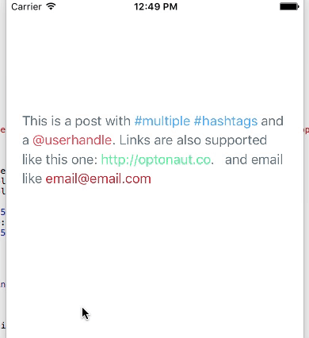

# ActiveLabel.swift [](https://github.com/Carthage/Carthage) [](https://travis-ci.org/optonaut/ActiveLabel.swift)

UILabel drop-in replacement supporting Hashtags (#), Mentions (@), URLs (http://) and custom regex patterns, written in Swift

## Features

* Swift 2+
* Default support for **Hashtags, Mentions, Links**
* Support for **custom types** via regex
* Ability to enable highlighting only for the desired types
* Ability to trim urls
* Super easy to use and lightweight
* Works as `UILabel` drop-in replacement
* Well tested and documented



## Usage

```swift
import ActiveLabel

let label = ActiveLabel()

label.numberOfLines = 0
label.enabledTypes = [.Mention, .Hashtag, .URL]
label.text = "This is a post with #hashtags and a @userhandle."
label.textColor = .blackColor()
label.handleHashtagTap { hashtag in
  print("Success. You just tapped the \(hashtag) hashtag")
}
```

## Custom types

```swift
    let customType = ActiveType.Custom(pattern: "\\swith\\b") //Regex that looks for "with"
    label.enabledTypes = [.Mention, .Hashtag, .URL, customType]
    
    label.customColor[customType] = UIColor.purpleColor()
    label.customSelectedColor[customType] = UIColor.greenColor()
    
    label.handleCustomTap(for: customType) { element in 
        print("Custom type tapped: \(element)") 
    }
```

## Enable/disable highlighting

By default, an ActiveLabel instance has the following configuration

```swift
    label.enabledTypes = [.Mention, .Hashtag, .URL]
```

But feel free to enable/disable to fit your requirements


## Batched customization

When using ActiveLabel, it is recommended to use the `customize(block:)` method to customize it. The reason is that ActiveLabel is reacting to each property that you set. So if you set 3 properties, the textContainer is refreshed 3 times.

When using `customize(block:)`, you can group all the customizations on the label, that way ActiveLabel is only going to refresh the textContainer once.

Example:

```swift

        label.customize { label in
            label.text = "This is a post with #multiple #hashtags and a @userhandle."
            label.textColor = UIColor(red: 102.0/255, green: 117.0/255, blue: 127.0/255, alpha: 1)
            label.hashtagColor = UIColor(red: 85.0/255, green: 172.0/255, blue: 238.0/255, alpha: 1)
            label.mentionColor = UIColor(red: 238.0/255, green: 85.0/255, blue: 96.0/255, alpha: 1)
            label.URLColor = UIColor(red: 85.0/255, green: 238.0/255, blue: 151.0/255, alpha: 1)
            label.handleMentionTap { self.alert("Mention", message: $0) }
            label.handleHashtagTap { self.alert("Hashtag", message: $0) }
            label.handleURLTap { self.alert("URL", message: $0.absoluteString) }
        }


```

## Trim long urls

You have the possiblity to set the maximum lenght a url can have;

```
        label.urlMaximumLength = 30
```

From now on, a url that's bigger than that, will be trimmed.

`https://afancyurl.com/whatever` -> `https://afancyurl.com/wh...`

## API

##### `mentionColor: UIColor = .blueColor()`
##### `mentionSelectedColor: UIColor?`
##### `hashtagColor: UIColor = .blueColor()`
##### `hashtagSelectedColor: UIColor?`
##### `URLColor: UIColor = .blueColor()`
##### `URLSelectedColor: UIColor?`
#### `customColor: [ActiveType : UIColor]`
#### `customSelectedColor: [ActiveType : UIColor]`
##### `lineSpacing: Float?`

##### `handleMentionTap: (String) -> ()`

```swift
label.handleMentionTap { userHandle in print("\(userHandle) tapped") }
```

##### `handleHashtagTap: (String) -> ()`

```swift
label.handleHashtagTap { hashtag in print("\(hashtag) tapped") }
```

##### `handleURLTap: (NSURL) -> ()`

```swift
label.handleURLTap { url in UIApplication.sharedApplication().openURL(url) }
```

##### `handleCustomTap(for type: ActiveType, handler: (String) -> ())`

```swift
label.handleCustomTap(for: customType) { element in print("\(element) tapped") }
```

##### `filterHashtag: (String) -> Bool`

```swift
label.filterHashtag { hashtag in validHashtags.contains(hashtag) }
```

##### `filterMention: (String) -> Bool`

```swift
label.filterMention { mention in validMentions.contains(mention) }
```

## Install (iOS 8+)

### Carthage

Add the following to your `Cartfile` and follow [these instructions](https://github.com/Carthage/Carthage#adding-frameworks-to-an-application)

```
github "optonaut/ActiveLabel.swift"
```

### CocoaPods

CocoaPods 0.36 adds supports for Swift and embedded frameworks. To integrate ActiveLabel into your project add the following to your `Podfile`:

```ruby
platform :ios, '8.0'
use_frameworks!

pod 'ActiveLabel'
```

## Alternatives

Before writing `ActiveLabel` we've tried a lot of the following alternatives but weren't quite satisfied with the quality level or ease of usage, so we decided to contribute our own solution.

* [TTTAttributedLabel](https://github.com/TTTAttributedLabel/TTTAttributedLabel) (ObjC) - A drop-in replacement for UILabel that supports attributes, data detectors, links, and more
* [STTweetLabel](https://github.com/SebastienThiebaud/STTweetLabel) (ObjC) - A UILabel with #hashtag @handle and links tappable
* [AMAttributedHighlightLabel](https://github.com/rootd/AMAttributedHighlightLabel) (ObjC) - A UILabel subclass with mention/hashtag/link highlighting
* [KILabel](https://github.com/Krelborn/KILabel) (ObjC) - A simple to use drop in replacement for UILabel for iOS 7 and above that highlights links such as URLs, twitter style usernames and hashtags and makes them touchable
